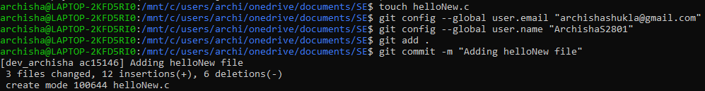

# SE Assignment 1 : Learning git

What is git?

Git is the most commonly used version control system. Git tracks the changes you make to files, so you have a record of what has been done, and you can revert to specific versions should you ever need to. Git also makes collaboration easier, allowing changes by multiple people to all be merged into one source.

The commands we have executed :-

---> git init // to initialize a local git repo

---> git add <file> // to add a file(or files) 
  
---> git status // Checks status of working tree
  
---> git commit -m "message" // to commit changes in index
  
---> git push // to push to remot repo
  
---> git pull // pull latest from remote repo
  
---> git clone // to clone a repo into a directory
  
---> git add . //add all files in the working directory
  
---> git branch new_branch // to create a new branch
  
---> git checkout new_branch //to checkout to new_branch
  
---> git fetch origin //downloads commits, files, and refs from a remote repository into your local repo
  
---> git log //to read the history of everything happening in the repo
  
---> git branch -d branch_to_be_deleted //to delete the local branch
  
---> git push origin --delete branch_to_be_deleted //to delete remote branch
  
  
# Screen shots of all commands we've tried :
  
  
